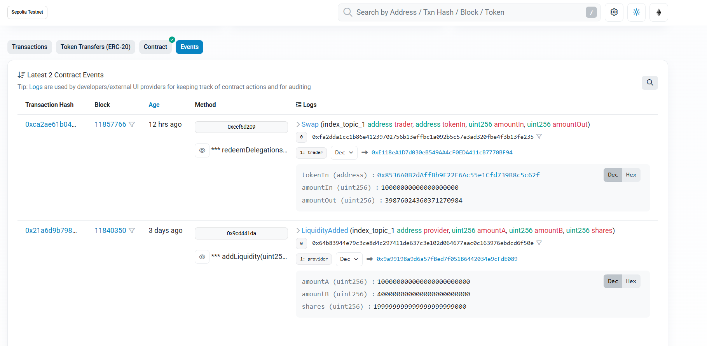
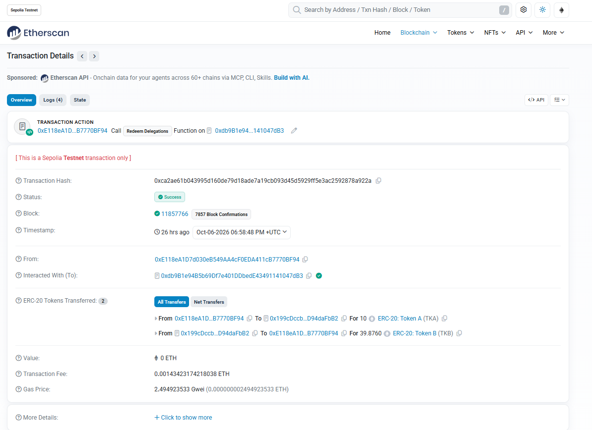
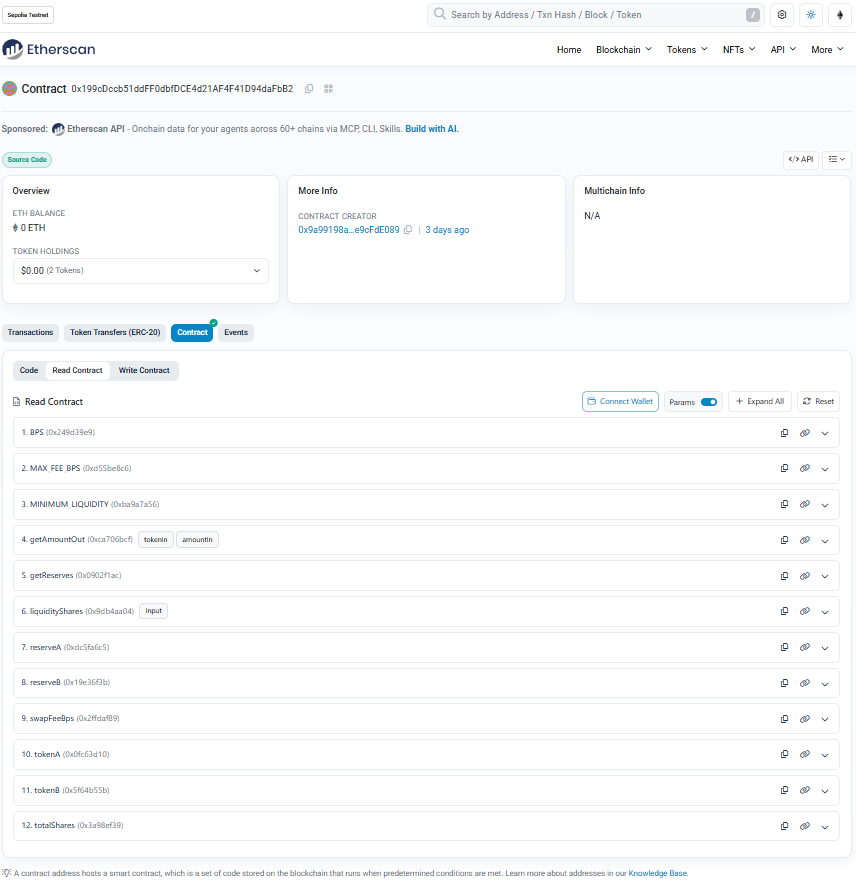

# Token Swap Pool

A minimal constant-product automated market maker (AMM) for a single ERC-20 pair, written in Solidity and tested with Foundry. Built for the Capstone Group 10 project.

Liquidity providers deposit both tokens and receive pool shares. Traders swap one token for the other at a price set by the `x * y = k` formula, paying a small fee that accrues to liquidity providers.

## Features

- **Add / remove liquidity** with proportional share accounting (Uniswap V2 style).
- **Constant-product swaps** in both directions with slippage protection (`minAmountOut`).
- **Configurable swap fee** in basis points, set at deployment (capped at 10%).
- **Locked minimum liquidity** on the first deposit to prevent share-price manipulation.
- **Reentrancy protection** and safe ERC-20 transfers (OpenZeppelin `ReentrancyGuard`, `SafeERC20`).
- **Quote function** (`getAmountOut`) that returns exactly what a swap would pay out.

## Project structure

```
src/TokenSwapPool.sol                         The pool contract
test/TokenSwapPool.t.sol                      Unit and fuzz tests (+ MockERC20)
test/invariant/TokenSwapPool.invariant.t.sol  Invariant tests with a handler
script/Deploy.s.sol                           Deploys test tokens + pool and seeds liquidity
frontend/                                     React + Vite + viem web app
foundry.toml                                  Compiler, fuzz, invariant and lint config
```

## Getting started

Requires [Foundry](https://book.getfoundry.sh/getting-started/installation).

```bash
git clone --recurse-submodules https://github.com/Tchalz/Token-swap.git
cd Token-swap
forge build
forge test
```

Useful extras:

```bash
forge test -vv                 # show logs and revert reasons
forge coverage                 # coverage table
forge test --gas-report        # per-function gas costs
forge lint                     # static lint checks
```

## Live demo (Sepolia testnet)

**Live app:** https://token-swap-khaki-beta.vercel.app

The contracts are deployed on the Sepolia test network and can be inspected on Etherscan:

| Contract | Address |
|---|---|
| Pool (`TokenSwapPool`) | [`0x199cdccb51ddff0dbfdce4d21af4f41d94dafbb2`](https://sepolia.etherscan.io/address/0x199cdccb51ddff0dbfdce4d21af4f41d94dafbb2) |
| Token A (TKA) | [`0x8536a0b2daffbb9e22e6ac55e1cfd739b8c5c62f`](https://sepolia.etherscan.io/address/0x8536a0b2daffbb9e22e6ac55e1cfd739b8c5c62f) |
| Token B (TKB) | [`0x9b43c9a0f7aeb471e3859e8dca1c85ee5a53adbd`](https://sepolia.etherscan.io/address/0x9b43c9a0f7aeb471e3859e8dca1c85ee5a53adbd) |

The pool was seeded with 100,000 TKA and 400,000 TKB (1 TKA = 4 TKB) at a 0.3% swap fee. The raw deployment record is in `broadcast/Deploy.s.sol/11155111/run-latest.json`.

All three contracts are verified on Etherscan, so the source can be read and called from the **Contract** tab: [Pool](https://sepolia.etherscan.io/address/0x199cdccb51ddff0dbfdce4d21af4f41d94dafbb2#code), [TKA](https://sepolia.etherscan.io/address/0x8536a0b2daffbb9e22e6ac55e1cfd739b8c5c62f#code), [TKB](https://sepolia.etherscan.io/address/0x9b43c9a0f7aeb471e3859e8dca1c85ee5a53adbd#code).

To use the web app against Sepolia:

```bash
cd frontend
npm install
VITE_NETWORK=sepolia npm run dev
```

Open the printed URL, click **Connect MetaMask** (it switches to Sepolia), and use the **Get 1,000 TKA + 1,000 TKB** button to mint test tokens. Every transaction needs a little Sepolia ETH for gas, which you can get from any public Sepolia faucet. TKA and TKB are open-mint test tokens with no value.

### Evidence

The pool's events on Etherscan: the seed deposit (with the 1,000 locked shares) and a live swap of 10 TKA for 39.876 TKB.



The swap transaction itself:



The pool's reserves, read directly from the verified contract:



## Run the demo (local chain + web app)

You need [Foundry](https://book.getfoundry.sh/getting-started/installation), [Node.js](https://nodejs.org) 18 or newer, and the [MetaMask](https://metamask.io) browser extension.

**1. Start a local chain** (leave this terminal running)

```bash
anvil
```

**2. Deploy the contracts** (in a second terminal, from the project root)

```bash
forge script script/Deploy.s.sol --tc Deploy \
  --rpc-url http://127.0.0.1:8545 \
  --broadcast \
  --private-key 0xac0974bec39a17e36ba4a6b4d238ff944bacb478cbed5efcae784d7bf4f2ff80
```

This deploys two test tokens (TKA, TKB) and the pool, then seeds it with 100,000 TKA and 400,000 TKB (1 TKA = 4 TKB). On a fresh Anvil chain the addresses are:

| Contract | Address |
|---|---|
| Token A (TKA) | `0x5fbdb2315678afecb367f032d93f642f64180aa3` |
| Token B (TKB) | `0xe7f1725e7734ce288f8367e1bb143e90bb3f0512` |
| Pool | `0x9fe46736679d2d9a65f0992f2272de9f3c7fa6e0` |

The frontend is already configured with these. If your deploy prints different addresses, update them in `frontend/src/config.js`.

The private key above is Anvil's well-known first test account. It is public and holds only fake ETH on your local chain. Never use it, or send real funds to its address, on any real network.

**3. Start the web app** (in a third terminal)

```bash
cd frontend
npm install
npm run dev
```

Open the URL it prints, normally `http://localhost:5173`.

**4. Set up MetaMask**

- Choose **Add wallet**, then **Import an account**, and paste the private key from step 2. The account will hold 10,000 fake ETH.
- Click **Connect MetaMask** in the app. It offers to add the "Anvil Local" network (chain ID 31337), so approve it.

**5. Try it**

1. Click **Get 1,000 TKA + 1,000 TKB** to mint test tokens.
2. Enter an amount in **Swap**. A live quote appears, and the swap uses 1% slippage protection.
3. Add liquidity (the TKB amount auto-fills to match the pool ratio), then remove it with the 25%, 50% or 100% buttons.

### Troubleshooting

| Problem | Fix |
|---|---|
| Page shows errors or empty reserves | Anvil isn't running, or it was restarted. Run step 2 again. |
| "does not have any code" | The chain was reset. Redeploy with step 2. |
| MetaMask nonce or "transaction underpriced" errors after restarting Anvil | In MetaMask: Settings, Advanced, **Clear activity tab data**. |
| Red network-fee warning in MetaMask | The connected account has no ETH on Anvil. Use the imported test account. |
| Repeated "execution reverted" lines in the Anvil log | Normal. MetaMask probes the pool for token details, and the pool correctly refuses. |

## Contract overview

### Constructor

```solidity
constructor(address _tokenA, address _tokenB, uint256 _swapFeeBps)
```

Reverts if either token is the zero address, if both tokens are the same, or if the fee exceeds 1,000 bps (10%). Use `30` for a 0.3% fee or `0` for no fee.

### Functions

| Function | Description |
|---|---|
| `addLiquidity(amountADesired, amountBDesired)` | Deposits both tokens and mints shares. After the first deposit, amounts are matched to the current ratio and only the required amounts are taken. |
| `removeLiquidity(sharesToBurn)` | Burns shares and returns a proportional amount of both tokens. |
| `swap(tokenIn, amountIn, minAmountOut)` | Swaps an exact input amount. Reverts if the output is below `minAmountOut`. |
| `getAmountOut(tokenIn, amountIn)` | Read-only quote for a swap. |
| `getReserves()` | Returns `(reserveA, reserveB)`. |

### Swap formula

With the fee applied to the input:

```
amountInWithFee = amountIn * (10000 - swapFeeBps)
amountOut       = (amountInWithFee * reserveOut) / (reserveIn * 10000 + amountInWithFee)
```

The full `amountIn` (fee included) is added to the reserves. Because the output is computed from the fee-adjusted amount, `k = reserveA * reserveB` grows with every swap, and liquidity providers collect that growth when they withdraw.

## Design decisions

- **First deposit sets the price.** Shares minted are `sqrt(amountA * amountB) - MINIMUM_LIQUIDITY`. This follows Uniswap V2.
- **1,000 shares are permanently locked** to `address(0)` on the first deposit. This blocks the classic attack where a tiny first deposit followed by a donation inflates the share price and rounds later depositors down to zero.
- **Shares use the smaller of the two ratios.** Later deposits mint `min(amountA * totalShares / reserveA, amountB * totalShares / reserveB)`, so rounding never favours the depositor.
- **Checks, effects, interactions.** State is updated before tokens move, and every state-changing function is `nonReentrant`.
- **Rounding always favours the pool.** All divisions round down, so a user can never extract more than they put in.
- **Simple shares instead of an LP token.** Shares are tracked in a mapping rather than an ERC-20. This is less composable but keeps the contract small and easy to audit.

## Testing

### Unit and fuzz tests (34 tests)

Covering the constructor, `addLiquidity`, `removeLiquidity`, `swap`, quotes and rounding edge cases. Four fuzz tests run 1,000 iterations each and check:

- `k` never decreases across a swap.
- `getAmountOut` always equals the amount actually received.
- Depositing and immediately withdrawing is never profitable.
- Tracked reserves equal real token balances after any mix of operations.

### Invariant tests (5 invariants)

A handler contract drives random, bounded calls to `addLiquidity`, `removeLiquidity` and `swap` from three actors (256 runs of 100 calls, 25,600 calls per invariant). After every sequence, these must hold:

| Invariant | Meaning |
|---|---|
| `reservesMatchBalances` | `reserveA` and `reserveB` equal the pool's token balances. |
| `sharesAddUp` | LP shares plus locked shares equal `totalShares`. |
| `kNeverDecreases` | No swap or deposit reduces `reserveA * reserveB`. |
| `lockedLiquidityIntact` | The 1,000 locked shares are never touched. |
| `reservesNeverZero` | The pool can never be drained to zero in either token. |

## Results

**Coverage**

| Metric | Result |
|---|---|
| Lines | 100% (79/79) |
| Statements | 100% (110/110) |
| Branches | 100% (18/18) |
| Functions | 100% (8/8) |

**Gas (average, from `forge test --gas-report`)**

| Function | Gas |
|---|---|
| `swap` | ~75,000 |
| `removeLiquidity` | ~77,000 |
| `addLiquidity` (normal deposit) | ~256,000 |
| `getAmountOut` | ~6,600 |

Deployed contract size is about 6.6 KB, well under the 24 KB limit.

## Known limitations

- **Standard ERC-20 tokens only.** Fee-on-transfer and rebasing tokens would break the reserve accounting, because reserves are updated from the requested amounts rather than measured balances.
- **No slippage parameters on `addLiquidity`.** A deposit can be front-run to a worse ratio. A production version would add `amountAMin` and `amountBMin`.
- **No deadline parameter** on swaps or deposits.
- **Fee is fixed at deployment** and there is no protocol fee or admin role.
- **No price oracle or flash swaps.**
- **Shares are not transferable**, since they are a mapping and not an ERC-20.
- **Not audited.** This is a learning project and should not hold real funds.

## Possible extensions

- Turn shares into an ERC-20 LP token.
- Add minimum-amount and deadline parameters to liquidity and swap calls.
- Add a TWAP price oracle.
- Support a factory that deploys one pool per token pair.
- Add a frontend that uses `getAmountOut` and `getReserves`.

## License

MIT
